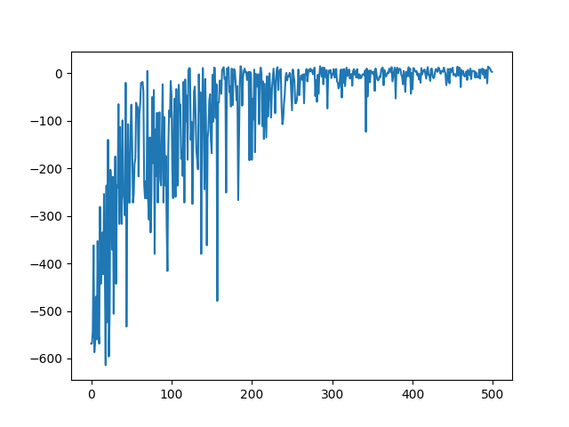
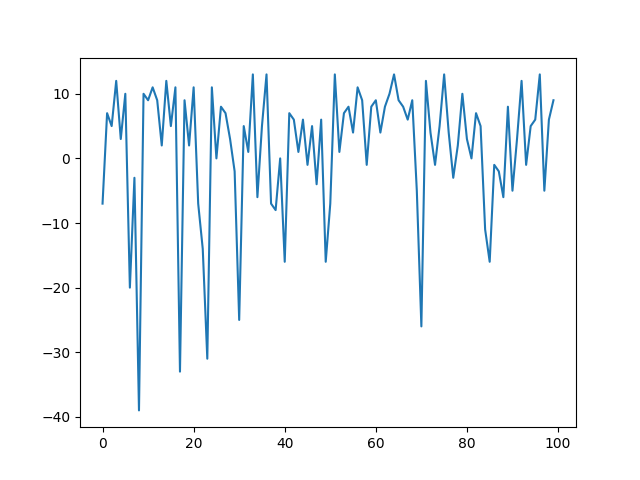
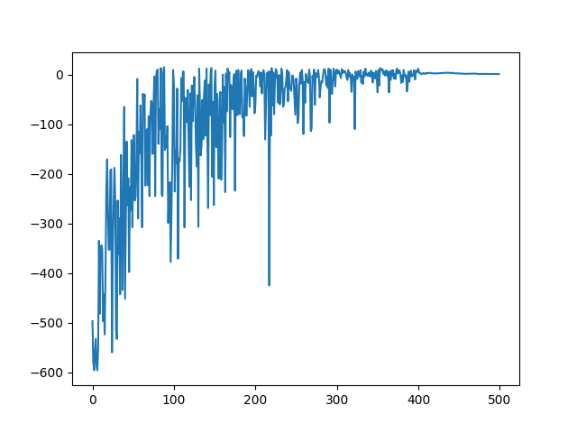

### Домашнее задание: Разработка агента Taxi V3 для решения задачи с конечным набором состояний и действий

1. График обучения агента

2. Сумма вознаграждений за последние 100 эпизодов обучения составляет около 160. Однако в зависимости от сеансов обучения эта величина нестабильна. Может уходить в отрицательные значения. Чтобы увеличить сумму вознаграждения можно отрегулировать гиперпараметр эпсилон в более низкое значение, например 0.05 что заставит агента действовать более жадно и увеличит сумму вознаграждения

* График вознагграждения на последних 100 эпизодах

3. График обучения агента с усредненным вознаграждением за последние 100 эпизодов

